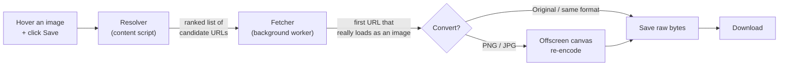

# Fullsize

**Grab the highest-quality version of any image on the web — and save it in the format you want.**


---

The image you see on a web page is often **not** the best one available. Sites load shrunk, compressed, or WebP copies while a larger original sits one URL edit away. Chrome's "Save image as…" only grabs what's on screen — the thumbnail, the blurry one, the wrong format.

**Fullsize grabs what's *possible*.** Hover any image, click **Save**, and it hunts down the highest-resolution version that actually exists, then saves it as the original, a PNG, or a JPG.

It runs entirely in your browser. No account, no server, no tracking, no data collected — ever.

---

## Features

- **Finds the true full-size original**, not the thumbnail rendered on the page.
- **Understands how platforms shrink images.** It recognises the URL patterns used by WordPress, Shopify, Wikimedia, Cloudinary, and common image CDNs, and reaches past them to the original file.
- **Reads responsive image sets.** It parses `srcset` and `<picture>`/`<source>` elements to find the largest version a page advertises — including the high-res sources most tools miss.
- **Format conversion on the spot** — save as Original, PNG, or JPG.
- **Transparency-aware.** PNG keeps its alpha channel intact; JPG gets a clean white background instead of black.
- **Never re-encodes when it doesn't have to.** "Original" saves the raw bytes untouched, and asking for a format the image is already in skips conversion entirely — so there's no quality loss.
- **Stays out of the way.** It ignores tiny icons, spacers, and tracking pixels, so the Save button only appears on images worth saving.
- **Zero dependencies.** Pure vanilla JavaScript. No frameworks, no build step, no bundler.

---

## How it works

Fullsize is split into two halves that talk to each other — one that *sees* the page, and one that *does* the work.



The clever part is the **resolver**. When you click Save, it doesn't just take the image's on-screen URL. It builds a *ranked list* of better candidates:

1. **Parse `srcset` and `<picture>` sources** to find the largest resolution the page already offers.
2. **Strip resize parameters from the URL** to guess at the original — e.g. WordPress `photo-1024x683.jpg` → `photo.jpg`, Shopify `shirt_400x400.jpg` → `shirt.jpg`, Wikimedia thumbnails back to the full file, and known resize query params (`?w=`, `?width=`, etc.) removed.
3. **Fall back safely.** Every guess is stacked *above* a URL that's known to work, so an over-eager strip just falls through to a working version. Risky guesses (like blindly dropping a whole query string) are ranked dead last, so they're only ever tried when everything trustworthy has failed.

The background worker then walks that list, **fetches each candidate and verifies it genuinely decodes as an image** (so a server returning a disguised error page can't fool it), keeps the first one that's at least as large as what was on screen, and hands it off to be saved.

---

## Installation

Fullsize isn't on the Chrome Web Store yet, so load it as an unpacked extension:

1. **Download this repo** — click the green **Code** button → **Download ZIP**, then unzip it (or `git clone` it).
2. Open Chrome and go to `chrome://extensions`.
3. Turn on **Developer mode** (top-right toggle).
4. Click **Load unpacked** and select the `fullsize` folder.
5. *(Optional)* To use it on local `file://` pages, click **Details** on the Fullsize card and enable **Allow access to file URLs**.

That's it — hover any image on any page and the Save button appears.

---

## Usage

1. **Hover** over any image.
2. Click the **Save** button that appears in the corner.
3. Click the **▾** caret to choose **Original**, **PNG**, or **JPG**.

Done — the file lands in your Downloads folder at the best resolution Fullsize could find.

---

## Privacy

Fullsize collects **nothing**. All image detection, URL resolving, fetching, and format conversion happen locally in your browser. There's no analytics, no tracking, and no server.

The only network request Fullsize makes is to fetch the image you asked to save — directly from the site hosting it, exactly the request your browser already makes to display the picture.

---

## Project structure

```
fullsize/
├── manifest.json        Extension config, permissions, script registration
├── content.js           Detects images, shows the hover UI, runs the resolver
├── background.js         Fetches + verifies candidates, manages downloads
├── offscreen.js          Converts images to PNG/JPG (offscreen canvas)
├── offscreen.html        Host page for the offscreen conversion
├── styles.css            Styling for the injected hover button (host-page isolated)
├── test-page.html        Dev fixture — every resolver case in one page
└── test-isolation.html   Dev fixture — hostile-CSS test for host-page isolation
```

It's Manifest V3, vanilla JavaScript, with **no dependencies and no build step** — clone it and it runs.

---

## Development & testing

There's no build process — edit a file, reload the extension at `chrome://extensions`, and refresh the page.

Two dev fixtures make testing fast without hunting live sites:

- **`test-page.html`** exercises every resolver case — WordPress, Shopify, Wikimedia, `srcset`, `<picture>`, lazy-loading, WebP, and a tiny spacer that should be ignored. Open the background worker's console (the **service worker** link on the extension card) to see which candidate won and at what resolution.
- **`test-isolation.html`** throws hostile CSS at the injected button to confirm the host page can't restyle it or hijack its clicks.

---

## Contributing

Contributions are very welcome — this is exactly the kind of small, focused tool that gets better with more eyes and more real-world test cases.

Especially useful:
- **New URL patterns** for image hosts and CDNs the resolver doesn't handle yet.
- **Bug reports** with a link to a page where the wrong image (or no upgrade) is saved.
- **Edge cases** the dev fixtures don't cover.

Open an issue or send a pull request. If you're adding a resolver pattern, please include a test case in `test-page.html` so it's easy to verify.

---

## Roadmap

Planned or under consideration:
- **Shadow-root DOM isolation** so the injected UI is fully sealed from the host page.
- **Batch download** — grab every image on a page at once.
- **CSS background-image and `<canvas>` capture** for images that aren't `` elements.
- **Firefox support.**

---
## License

[MIT](LICENSE) — free to use, modify, and build on. Just keep the copyright notice.
---

<p align="center">
  <a href="https://buymeacoffee.com/dipps" target="_blank">
    
  </a>
</p>

<p align="center"><sub>If Fullsize is useful to you, you can support development ☕</sub></p>
